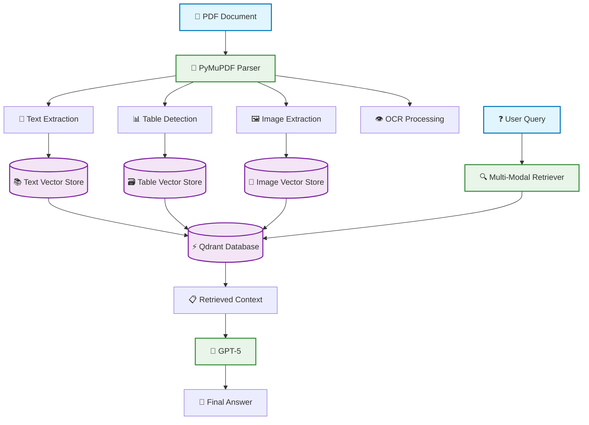
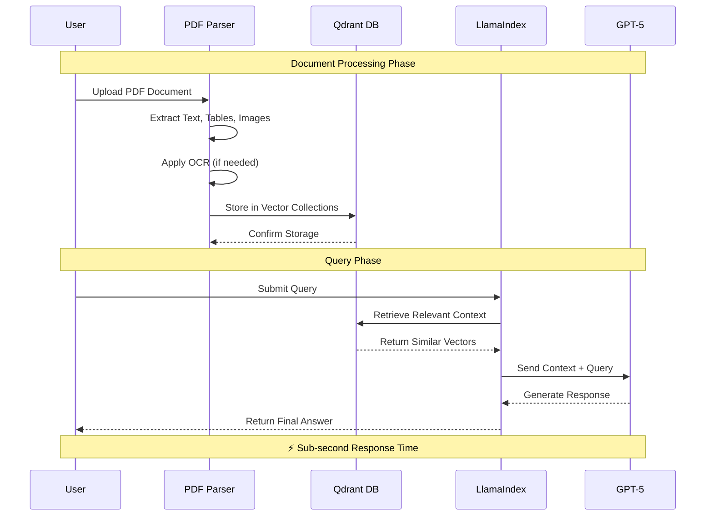

# 🚀 Modular RAG with Qdrant, GPT-5, and PyMuPDF

[](https://python.org)
[](https://llamaindex.ai)
[](https://qdrant.tech)
[](https://openai.com)
[](https://pymupdf.readthedocs.io)
[](LICENSE)

A **lightning-fast**, **multi-modal** RAG (Retrieval-Augmented Generation) system that can process any PDF document including scanned images with OCR support. Built with cutting-edge technologies for maximum performance and ease of use.

## ✨ Key Features

🔥 **Blazing Fast** - Optimized vector storage with Qdrant for sub-second retrieval  
🧠 **GPT-5 Powered** - Latest OpenAI model for superior understanding and generation  
📄 **Universal PDF Support** - Works with all PDFs including scanned documents via OCR  
🎯 **Multi-Modal** - Handles text, tables, and images seamlessly  
⚡ **Simple Setup** - Get running in minutes with minimal configuration  
🔧 **Modular Design** - Easy to extend and customize for specific needs

## 🏗️ Architecture Overview



## 🛠️ Tech Stack

| Component | Technology | Purpose |
|-----------|------------|---------|
| **PDF Processing** | PyMuPDF + Tesseract | Fast text, table, and image extraction with OCR |
| **Vector Database** | Qdrant | High-performance vector storage and similarity search |
| **LLM** | GPT-5 (OpenAI) | Advanced language understanding and generation |
| **Framework** | LlamaIndex | Multi-modal RAG orchestration and indexing |
| **OCR Engine** | Tesseract | Optical character recognition for scanned documents |

## 📊 Workflow Diagram



## 🚀 Quick Start

### Installation

```bash
pip install pymupdf qdrant-client llama-index pytesseract pillow
```

### Basic Usage

```python
from rag_system import PDFParser, RAGEngine

# Initialize the parser
parser = PDFParser(
    output_dir="extracted",
    save_as_markdown=True,
    use_ocr=False  # Set True for scanned PDFs
)

# Process your PDF
results = parser.parse_pdf("your_document.pdf")

# Create RAG engine
engine = RAGEngine()
engine.setup_vector_stores()
engine.index_documents(results)

# Query the system
response = engine.query("What are the main findings in the paper?")
print(response)
```

## 💡 Why This RAG System?

### 🔥 **Performance**
- **Sub-second retrieval** with Qdrant's optimized vector search
- **Parallel processing** of PDF components (text, tables, images)
- **Efficient memory usage** with modular document handling

### 🎯 **Accuracy**
- **GPT-5 integration** for state-of-the-art language understanding
- **Multi-modal context** combining text, visual, and tabular data
- **Semantic search** beyond keyword matching

### 🛠️ **Versatility**
- **Works with any PDF** - digital or scanned
- **OCR support** for image-based documents
- **Table detection** preserves structured data
- **Image analysis** for visual content understanding

### ⚡ **Simplicity**
- **Minimal setup** required
- **Plug-and-play** architecture
- **Clear separation** of concerns
- **Easy to extend** and customize

## 📁 Project Structure

```
rag_service/
├── 📄 rag_service.ipynb    # Main implementation notebook
├── 📂 extracted/           # Processed document storage
│   ├── 📝 texts/          # Extracted text content
│   ├── 📊 tables/         # Detected tables
│   └── 🖼️ images/         # Extracted images
└── 📂 tmp/
    └── 🗃️ llama_multimodal/ # Qdrant vector database
```

## 🎯 Use Cases

- **📚 Research Paper Analysis** - Extract insights from academic papers
- **📋 Document Q&A** - Interactive querying of large documents  
- **🔍 Information Retrieval** - Find specific information across document collections
- **📊 Report Summarization** - Generate summaries from complex reports
- **🖼️ Visual Document Understanding** - Analyze documents with charts and diagrams

## 🔧 Core Components

### PDFParser Class
```python
class PDFParser:
    """Fast, multi-modal PDF content extraction"""
    - Text extraction (native + OCR)
    - Table detection and parsing
    - Image extraction and processing
    - Metadata preservation
```

### Vector Stores
```python
# Separate collections for different content types
text_store = QdrantVectorStore(collection_name="text_collection")
image_store = QdrantVectorStore(collection_name="image_collection")  
table_store = QdrantVectorStore(collection_name="table_collection")
```

### Multi-Modal Query Engine
```python
query_engine = index.as_query_engine(
    llm=openai_mm_llm,  # GPT-5
    text_qa_template=qa_template
)
```

## 🌟 What Makes It Special

1. **🚀 Speed**: Qdrant's optimized vector operations deliver results in milliseconds
2. **🎯 Accuracy**: GPT-5's advanced reasoning provides superior answer quality  
3. **🔧 Simplicity**: Clean, modular code that's easy to understand and modify
4. **📄 Compatibility**: Handles any PDF format including scanned documents
5. **🎨 Multi-Modal**: Seamlessly processes text, tables, and images together

---

<div align="center">

**Ready to revolutionize your document analysis workflow?**

[⭐ Star this repo](https://github.com/yourusername/modular-rag) • [🐛 Report issues](https://github.com/yourusername/modular-rag/issues) • [💡 Request features](https://github.com/yourusername/modular-rag/discussions)

</div>